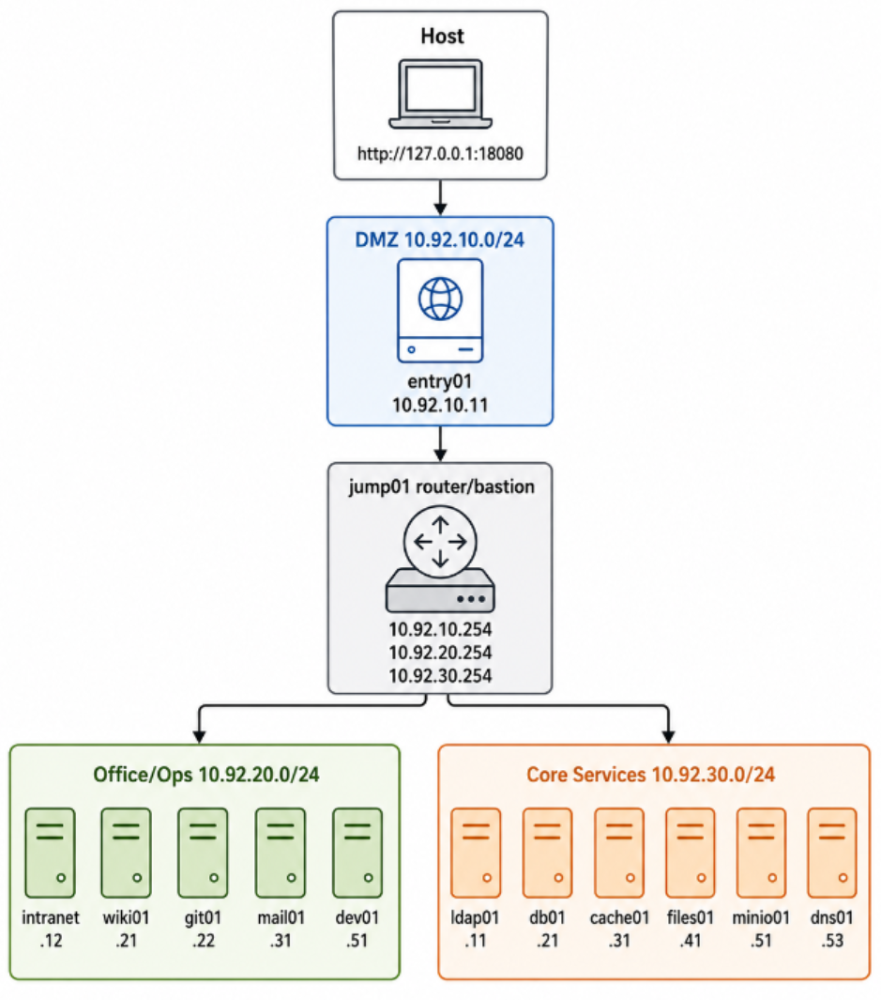

# Sentinel Mesh CTF Range

Sentinel Mesh is a Docker-based Linux CTF range for smart penetration testing practice. It keeps the original three-zone attack shape, but replaces all old names, IPs, vulnerabilities, and flags.

```text
host -> entry01 Apache HTTPD RCE in DMZ -> jump01 router/bastion -> office services -> core services
```

## Network Topology



| Zone | CIDR | Purpose |
| --- | --- | --- |
| DMZ | `10.92.10.0/24` | Externally reachable entry service |
| Office / Ops | `10.92.20.0/24` | Internal portal, code, mail, and workstation services |
| Core Services | `10.92.30.0/24` | LDAP, database, cache, file, object storage, and DNS |

## Nodes

| Node | Address | Service |
| --- | --- | --- |
| `entry01` | `10.92.10.10` | Apache HTTP Server 2.4.50 path traversal / CGI RCE, `CVE-2021-42013`, published at `http://127.0.0.1:18081/` |
| `jump01` | `10.92.10.20`, `10.92.20.254`, `10.92.30.254` | Linux router and SSH bastion, published at `127.0.0.1:2223` |
| `intranet` | `10.92.20.10` | Nginx internal portal and clues |
| `wiki01` | `10.92.20.11` | Apache Solr VelocityResponseWriter RCE, `CVE-2019-17558` |
| `git01` | `10.92.20.20` | GitLab ExifTool RCE, `CVE-2021-22205` |
| `mail01` | `10.92.20.30` | Mailpit mailbox and notification clues |
| `dev01` | `10.92.20.50` | Internal Linux workstation with CLI tools |
| `ldap01` | `10.92.30.10` | OpenLDAP directory |
| `db01` | `10.92.30.20` | MariaDB operations data and clue seed |
| `cache01` | `10.92.30.30` | CouchDB vulnerable chain, `CVE-2017-12635` / `CVE-2017-12636` |
| `files01` | `10.92.30.40` | ProFTPD mod_copy target, `CVE-2015-3306` |
| `minio01` | `10.92.30.50` | MinIO distributed cluster target, `CVE-2023-28432` shape |
| `dns01` | `10.92.30.53` | CoreDNS zone for `sentinel.local` |

## Flags

This range contains exactly 6 flags:

1. `entry01`: `/flag.txt`
2. `wiki01`: `/flag.txt`
3. `git01`: `/flag.txt`
4. `cache01`: `/flag.txt`
5. `files01`: `/flag.txt`; use the ProFTPD `mod_copy` vulnerability to copy it into the writable anonymous FTP area
6. `minio01`: `s3://flag/flag.txt`

No other node contains a flag. `jump01`, `intranet`, `mail01`, `dev01`, `ldap01`, `db01`, and `dns01` are pivot, clue, or data nodes only.

## Lab Credentials

These are synthetic local-lab credentials.

| Service | Username | Password |
| --- | --- | --- |
| `jump01` SSH | `jumpop` | `JumpPass123!` |
| `dev01` SSH | `analyst` | `Analyst123!` |
| MariaDB root | `root` | `Root-Sentinel!` |
| MariaDB app | `ops_svc` | `OpsSvc-Sentinel!` |
| OpenLDAP admin DN | `cn=admin,dc=sentinel,dc=local` | `LdapAdmin-Sentinel!` |
| MinIO root | `minioadmin` | `MinioRoot-Sentinel!` |

## Run

```powershell
docker compose up -d --build
```

The DMZ application is Apache HTTP Server 2.4.50 with `CVE-2021-42013`.
`entry01-netns` owns the unchanged `10.92.10.10` address and static routes;
the vulnerable Apache container shares that namespace without route-management
privileges. The default port binding is loopback-only. Set `ENTRY_BIND_IP=0.0.0.0`
only when the host firewall or cloud security group restricts access to authorized users.

Open the DMZ entry point:

```text
http://127.0.0.1:18081/
```

SSH into the jump host:

```powershell
ssh jumpop@127.0.0.1 -p 2223
```

Useful SSH tunnels:

```powershell
ssh -N `
  -L 18081:10.92.20.10:80 `
  -L 18983:10.92.20.11:8983 `
  -L 18082:10.92.20.20:80 `
  -L 18025:10.92.20.30:8025 `
  -L 15984:10.92.30.30:5984 `
  -L 19000:10.92.30.50:9000 `
  -L 19001:10.92.30.50:9001 `
  jumpop@127.0.0.1 -p 2223
```

## Validate

```powershell
.\scripts\test.ps1
```

## Stop and Remove

```powershell
docker compose down -v
```
